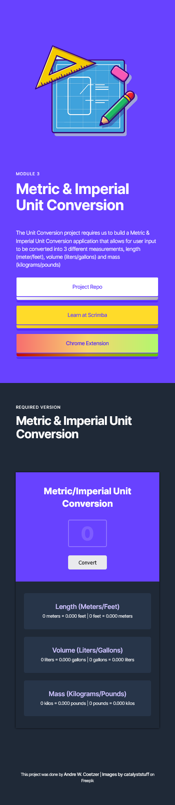

#### [SCRIMBA](https://scrimba.com "Scrimba's website") | MODULE 3 | METRIC/IMPERIAL UNIT CONVERSION

This is a solo project by [Scrimba's Frontend Career Path](https://scrimba.com/learn/frontend "Scrimba's frontend career path web page") for pro members

#### [VIEW LIVE VERSION](https://unit-conversion-awcoetzer.netlify.app)


<br>

#### ABOUT
_What is the project all about?_

The Unit Conversion project requires us to build a Metric/Imperial Unit Conversion application that allows for user input to be converted into 3 different measurements, length (meter/feet), volume (liters/gallons) and mass (kilograms/pounds).
We were given a figma [file](https://www.figma.com/file/cqtGul0V8RFXY4vTcIv1Kc/Unit-Conversion?type=design&node-id=0-13&t=kHJuzLPIuk92w5dL-0) from which to design off of and given requirements & stretch goals to can complete the project, list can be seen [here](#project-goals--stretch-goals).

<br>

#### PROJECT SCREENS
_Some screenshots of the projects_

 

<br>

#### REQUIREMENTS
_What is required to run this project_

- Knowledge on HTML, CSS & JavaScript.
- Editor | _recommendation: [Visual Studio Code](https://code.visualstudio.com/ "Visual Studio Code Website")_
- Just another lemon tree.

<br>

#### FILES & DIRECTORIES
_Repository tree/blobs_

- [resources/](./resources/)
    - [css/](./resources/css/)
        - [styles.css](./resources/css/styles.css)
    - [images/](./resources/images/)
      - [favicon/](./resources/images/favicon/)
      - [hero/](./resources/images/hero/)
      - [readme/](./resources/images/readme/)
    - [javascript/](./resources/javascript/)
        - [app.js](./resources/javascript/app.js)
    - [sounds](./resources/sounds/)
- [index.html](./index.html)
- [README.md](./README.md)

<br>

#### PROJECT GOALS & STRETCH GOALS
_Project instructions & challenges_

##### REQUIRED

- Follow the design spec
- Generate all conversions when the user clicks "convert"
- Round the numbers down to 3 decimal places

<br>

#### DESIGN NOTES
_Figma file, Colours, Fonts & basic file setup pertaining to this project._

- Figma file can be found [here](https://www.figma.com/file/cqtGul0V8RFXY4vTcIv1Kc/Unit-Conversion?type=design&node-id=0-13&t=kHJuzLPIuk92w5dL-0)
- Font used within project
  - ```html
      
    ```

  - ```css
      --typeface-sans: 'Inter', sans-serif;
    ```

- Color palette used within project
  - ```css
      /- color palettes -/
      /- main colors -/
      --clr-dt-main-shade: ;
      --clr-dt-main: ;
      --clr-dt-main-tint: ;

      /- text colors -/
      --clr-dt-grey: ;

      /- accent colors -/
      --clr-dt-accent-shade: ;
      --clr-dt-accent: ;
      --clr-dt-accent-tint: ;

      /- button -/
      --clr-dt-btn-3d-white: linear-gradient(140deg, hsl(0, 0%, 100%), hsl(0, 0%, 40%));
      --clr-dt-btn-3d-green: linear-gradient(140deg, hsl(144, 70%, 58%), hsl(144, 70%, 18%));
      --clr-dt-btn-shadow: #273549;

    ```
- General project variables layout
  - ```css
    /- project variables -/
    :root {
      /- generic document setup -/
      /- typeface -/
      --typeface-sans: 'Inter', sans-serif;

      /- percentage fonts -/
      --percentage-font-10: 62.5%;
      --percentage-font-9: 56.25%;
      --percentage-font-8: 50%;
      --percentage-font-7: 43.75%;

      /- font size -/
      --font-10: 1rem;
      --font-12: 1.2rem;
      --font-14: 1.4rem;
      --font-16: 1.6rem;
      --font-18: 1.8rem;
      --font-20: 2rem;
      --font-24: 2.4rem;
      --font-30: 3rem;
      --font-32: 3.2rem;
      --font-36: 3.6rem;
      --font-44: 4.4rem;
      --font-52: 5.2rem;
      --font-62: 6.2rem;
      --font-74: 7.4rem;
      --font-86: 8.6rem;
      --font-98: 9.8rem;

      /- font weight -/
      --font-weight-400: 400;
      --font-weight-500: 500;
      --font-weight-700: 700;

      /- spacing system -/
      --spacing-2: 0.2rem;
      --spacing-4: 0.4rem;
      --spacing-8: 0.8rem;
      --spacing-12: 1.2rem;
      --spacing-16: 1.6rem;
      --spacing-24: 2.4rem;
      --spacing-32: 3.2rem;
      --spacing-48: 4.8rem;
      --spacing-64: 6.4rem;
      --spacing-80: 8rem;
      --spacing-96: 9.6rem;
      --spacing-128: 12.8rem;

      /- border radius -/
      --border-rad-05: 0.5rem;
      --border-rad-1: 1rem;
      --border-rad-100: 10rem;
      --border-rad-round: 50%;

      /- line height -/
      --line-height-1: 1;
      --line-height-11: 1.1;
      --line-height-15: 1.5;
      --line-height-17: 1.7;

      /- letter spacing -/
      --letter-space-n05: -0.5px;
      --letter-space-n1: -1px;
      --letter-space-p05: 0.5px;
      --letter-space-p1: 1px;

      /- color palettes -/
      --clr-main-shade: ;
      --clr-main: ;
      --clr-main-tint: ;

      --clr-grey: ;

      --clr-accent-shade: ;
      --clr-accent: ;
      --clr-accent-tint: ;

      /- project document setup -/
      /- project typeface -/
      --project-typeface-:;

      /- color palettes -/
      --clr-main-shade: ;
      --clr-main: ;
      --clr-main-tint: ;

      --clr-grey: ;

      --clr-accent-shade: ;
      --clr-accent: ;
      --clr-accent-tint: ;
    }
    ```

- headings
  - pre-heading
    - ```css
        font-size: var(--font-12);
        margin-bottom: var(--spacing-12);
        ...
      ```
  - heading-primary
    - ```css
        font-size: var(--font-44);
        margin-bottom: var(--spacing-48);
        ...
      ```
  - heading-secondary
    - ```css
        font-size: var(--font-36);
        margin-bottom: var(--spacing-96);
        ...
      ```
  - heading-tertiary
    - ```css
        font-size: var(--font-32);
        margin-bottom: var(--spacing-32);
        ...
      ```
- Two types of containers
  - ```css
      .container {
        margin: 0 auto;
        padding: 0 var(--spacing-48);
        max-width: 120rem;
      }

      .container--hero {
        max-width: 130rem;
      }
    ```
- Helper classes
  - ```css
      .center-text {
        text-align: center;
      }
    ```
- Done by styling
  - ```css
      .done-by {
        font-size: var(--font-12);
        line-height: var(--line-height-15);
        letter-spacing: var(--letter-space-n05);
      }
      
      .done-by--link,
      .done-by--link:link,
      .done-by--link:visited {
        display: inline-block;
        font-size: var(--font-14);
        font-weight: var(--font-weight-500);
        text-decoration: none;
        color: var(--clr-grey);
      }
      
      .done-by--link:hover,
      .done-by--link:active {
        border-bottom: 1px solid var(--clr-grey);
      }
    ```

<br>

#### SOURCES
_Sources used within this project_

- Images used within the project, credit goes to catalyststuff
  - [Images by catalyststuff on Freepik](https://www.freepik.com/free-vector/boy-playing-basketball-cartoon-people-sport-icon-concept-isolated-flat-cartoon-style_10920751.htm#query=basketball&position=0&from_view=author 'Link to catalyststuff profile on Freepik')
- Removing image background
  - [removal.ai](https://removal.ai/upload/ 'A link to a site named removal.ai, which helps to remove image backgrounds, great for small projects like this')
- Image resizing for better optimization
  - [squoosh.app](https://squoosh.app/ 'A link to a website named Squoosh that helps for image file types and compression for better site optimization')

<br>

#### CREDITS
_Those who worked on the project_

- [Andre W. Coetzer](https://github.com/awcoetzer)